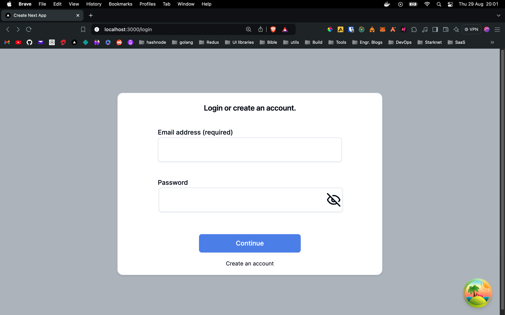
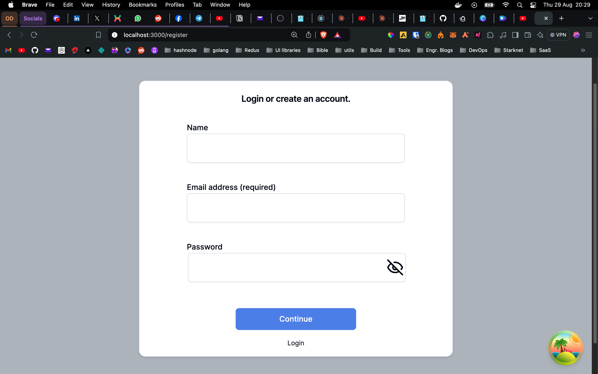
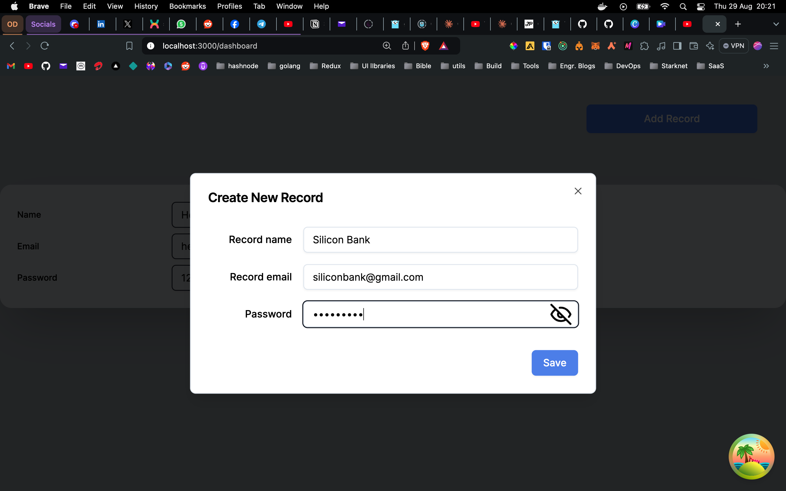
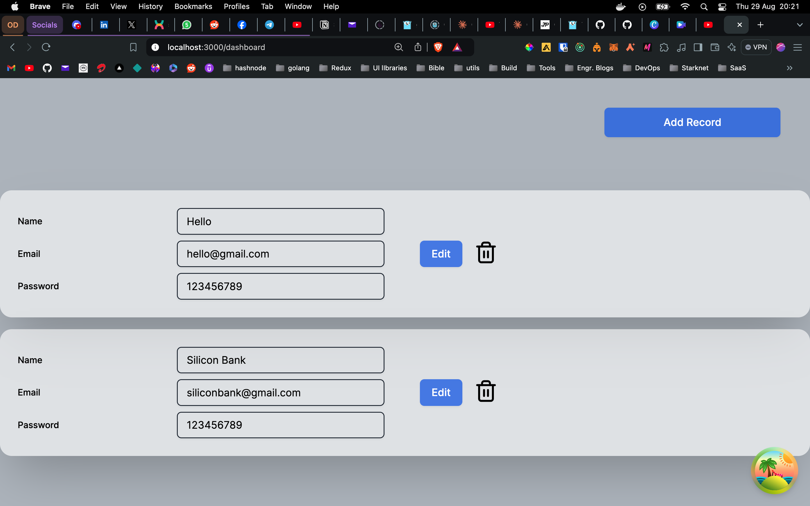

## PASSWORD MANAGER
A Simple Frontend for interacting with a backend that keeps your passwords safe in an encrypted form until you want it 

[Link to the backend written in Golang](https://github.com/Shoetan/passINBE)

## TECH STACK

* Next Js 14
* TypeScript
* Tanstack query
* Axios

## How it works

Upon arrival on the page, you have a login form to have access to your dashboard looking like below

If you are yet to have an account then you can create an account. Your details are saved in a PostgreSQL database. 

Upon successfully login you can have access to your dashboard where you can add a record

Once a record is added it appears on the dashboard where you can see the details, edit and delete the records completely.

